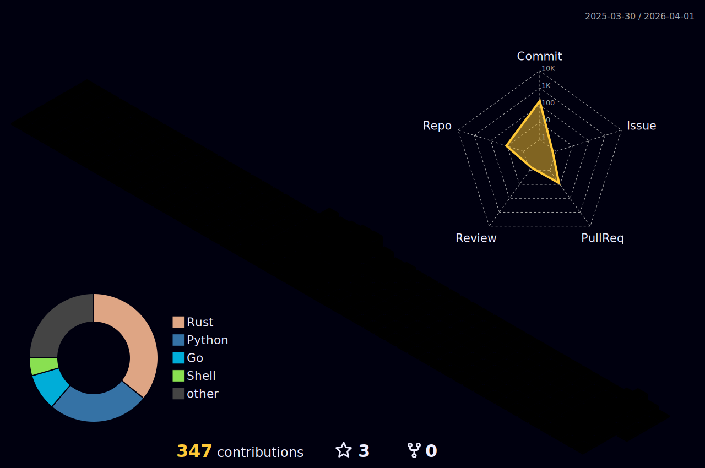

<div align="center">

</div>

## `me.about`
```rust
<GitHubProfile as Profile>::show(ctx, models::AboutMe {
  username: String::new("kompl3xpr"),
  age: Utc::now().year() - 2001,
  description: "🚀 Back-End Developer",
  company: find_job().await,
}).await?
```

<div align="center">


</div>

## `me.stats`
<details>
<summary>CLICK TO EXPAND</summary>
<table width=100% border="0" cellspacing="0" cellpadding="0">
    <tr></tr>
    <tr>
        <td>
            
        </td>
        <td>
            
        </td>
    </tr>
    <tr></tr>
    <tr>
        <td colspan="2">
            
        </td>
    </tr>
</table>


</details>

## `me.repos`

<div align="center">

<!-- <br>
<div align="center">
  <a href="https://github.com/kompl3xpr/run_ruby_bot" title="run_ruby_bot">
    
  </a>
  <a href="https://github.com/kompl3xpr/wmonitor" title="Data Structures">
    
  </a>
</div>
<br> -->

[`me.repos.show_more()`](https://github.com/kompl3xpr?tab=repositories)


</div>
